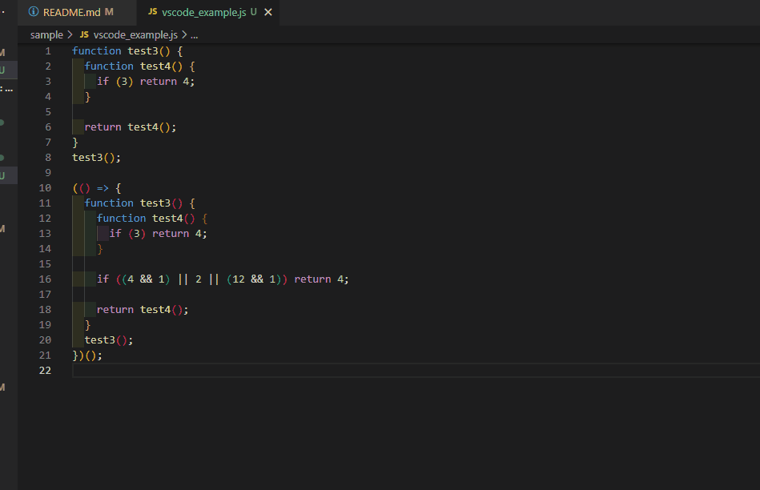

# cognitive-complexity-show README

## Features

Show file cognitive complexity. (Only supported .js, ts, .jsx, .tsx)

Start with `Toggle cognitive-complexity-show` command.

And stop with same command.

Other command.

* `Execute cognitive-complexity-show`, execute only once.
* `Clear cognitive-complexity-show`, clear all.

## Release Notes

### 0.0.6

* [feat: enabling extension on extension be activated](https://github.com/ampcpmgp/vscode-cognitive-complexity-show/pull/4)

### 0.0.5

* Fix cannot stop by toggle.

### 0.0.4

* Default value of toggle state is false.

### 0.0.3

* Build error fix.

### 0.0.2

* Feature watch mode.
* Display number first.

### 0.0.1

* Initial release of cognitive-complexity-show.

**Enjoy!**
